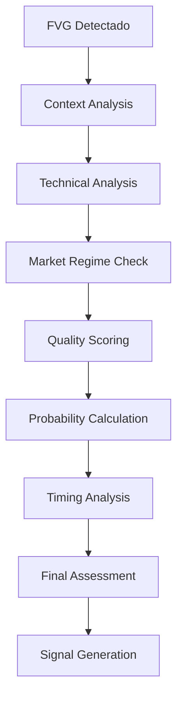

# 📊 **OFICINA DE ANÁLISIS FVG**
**Análisis Contextual y Evaluación de Fair Value Gaps**

**Fecha:** Agosto 12, 2025  
**Oficina:** Análisis - Piso 3  
**Responsable:** FVGAnalyzer Class  
**Estado:** Documentación Técnica Completa

---

## 🎯 **MISIÓN DE LA OFICINA**

Realizar análisis contextual profundo de FVGs detectados, evaluando:
- **Calidad técnica** basada en múltiples indicadores
- **Contexto de mercado** y alineación con tendencias
- **Probabilidad de llenado** mediante modelos estadísticos
- **Timing óptimo** para maximizar probabilidades de éxito

---

## 🏗️ **ARQUITECTURA TÉCNICA**

### **📊 COMPONENTES PRINCIPALES**

```
FVGAnalyzer
├── ContextAnalyzer          # Análisis de contexto de mercado
├── QualityScorer           # Evaluación de calidad multi-factor
├── ProbabilityCalculator   # Cálculo de probabilidades de llenado
├── TechnicalAnalyzer       # Análisis técnico avanzado
├── MarketRegimeDetector    # Detección de régimen de mercado
└── TimingAnalyzer          # Análisis de timing óptimo
```

### **🔧 PIPELINE DE ANÁLISIS**



---

## 🧮 **ANÁLISIS CONTEXTUAL**

### **🌐 CONTEXT ANALYZER**

```python
class ContextAnalyzer:
    def __init__(self):
        self.trend_lookback = 100  # Velas para análisis de tendencia
        self.support_resistance_buffer = 20  # Buffer en pips para niveles
        self.volume_lookback = 20  # Períodos para análisis de volumen
        
    def analyze_market_context(self, fvg, market_data):
        """
        Analiza el contexto completo del mercado para el FVG
        
        Args:
            fvg: Dict - FVG detectado
            market_data: Dict - Datos de mercado (velas, indicadores, etc.)
            
        Returns:
            Dict - Análisis contextual completo
        """
        context = {
            'trend_analysis': self._analyze_trend_context(fvg, market_data),
            'session_analysis': self._analyze_session_context(fvg),
            'support_resistance': self._analyze_sr_levels(fvg, market_data),
            'volume_analysis': self._analyze_volume_context(fvg, market_data),
            'volatility_analysis': self._analyze_volatility_context(fvg, market_data)
        }
        
        # Calcular score contextual agregado
        context['overall_score'] = self._calculate_context_score(context)
        context['context_category'] = self._categorize_context(context['overall_score'])
        
        return context
        
    def _analyze_trend_context(self, fvg, market_data):
        """Analiza alineación con tendencia principal"""
        candles = market_data['candles']
        
        # Calcular EMAs para tendencia
        ema_short = self._calculate_ema(candles, 20)
        ema_long = self._calculate_ema(candles, 50)
        
        # Determinar tendencia
        current_price = candles[-1]['close']
        trend_direction = 'BULLISH' if ema_short > ema_long else 'BEARISH'
        trend_strength = abs(ema_short - ema_long) / current_price
        
        # Evaluar alineación
        is_aligned = (fvg['type'] == trend_direction)
        
        # Análisis de momentum
        rsi = market_data.get('rsi', 50)
        macd_histogram = market_data.get('macd_histogram', 0)
        
        momentum_aligned = False
        if fvg['type'] == 'BULLISH':
            momentum_aligned = rsi < 70 and macd_histogram > 0
        else:
            momentum_aligned = rsi > 30 and macd_histogram < 0
            
        return {
            'trend_direction': trend_direction,
            'trend_strength': trend_strength,
            'is_aligned': is_aligned,
            'momentum_aligned': momentum_aligned,
            'ema_short': ema_short,
            'ema_long': ema_long,
            'alignment_score': self._calculate_alignment_score(is_aligned, momentum_aligned, trend_strength)
        }
        
    def _analyze_session_context(self, fvg):
        """Analiza contexto de sesión de trading"""
        formation_time = pd.to_datetime(fvg['formation_time'])
        
        # Determinar sesión
        hour_utc = formation_time.hour
        session = self._get_trading_session(hour_utc)
        
        # Factores de sesión
        session_factors = {
            'LONDON': {
                'liquidity_factor': 1.2,
                'volatility_factor': 1.1,
                'fill_probability_boost': 0.15
            },
            'NY': {
                'liquidity_factor': 1.3,
                'volatility_factor': 1.2,
                'fill_probability_boost': 0.18
            },
            'OVERLAP': {
                'liquidity_factor': 1.5,
                'volatility_factor': 1.4,
                'fill_probability_boost': 0.25
            },
            'ASIA': {
                'liquidity_factor': 0.7,
                'volatility_factor': 0.6,
                'fill_probability_boost': -0.10
            }
        }
        
        factors = session_factors.get(session, session_factors['ASIA'])
        
        return {
            'session': session,
            'formation_hour_utc': hour_utc,
            'liquidity_factor': factors['liquidity_factor'],
            'volatility_factor': factors['volatility_factor'],
            'fill_probability_boost': factors['fill_probability_boost'],
            'session_score': self._calculate_session_score(session)
        }
        
    def _analyze_sr_levels(self, fvg, market_data):
        """Analiza proximidad a niveles de soporte/resistencia"""
        candles = market_data['candles']
        
        # Identificar niveles de S/R usando fractales
        sr_levels = self._identify_sr_levels(candles)
        
        # Verificar proximidad del FVG a niveles importantes
        gap_center = (fvg['gap_low'] + fvg['gap_high']) / 2
        
        nearest_level = None
        min_distance = float('inf')
        
        for level in sr_levels:
            distance = abs(gap_center - level['price'])
            if distance < min_distance:
                min_distance = distance
                nearest_level = level
                
        # Convertir distancia a pips
        distance_pips = min_distance * 10000
        
        # Evaluar si está cerca de nivel importante
        is_near_sr = distance_pips <= self.support_resistance_buffer
        
        return {
            'nearest_sr_level': nearest_level,
            'distance_to_sr_pips': distance_pips,
            'is_near_sr': is_near_sr,
            'sr_confluence': len([l for l in sr_levels if abs(gap_center - l['price']) * 10000 <= 10]),
            'sr_score': self._calculate_sr_score(distance_pips, is_near_sr)
        }
        
    def _calculate_context_score(self, context):
        """Calcula score contextual agregado"""
        weights = {
            'trend': 0.35,
            'session': 0.25,
            'sr': 0.25,
            'volume': 0.10,
            'volatility': 0.05
        }
        
        scores = {
            'trend': context['trend_analysis']['alignment_score'],
            'session': context['session_analysis']['session_score'],
            'sr': context['support_resistance']['sr_score'],
            'volume': context['volume_analysis']['volume_score'],
            'volatility': context['volatility_analysis']['volatility_score']
        }
        
        weighted_score = sum(weights[key] * scores[key] for key in weights)
        return round(weighted_score, 2)
```

### **🎯 QUALITY SCORER**

```python
class QualityScorer:
    def __init__(self):
        self.size_weights = {
            'micro': 1.0,    # <1 pip
            'small': 2.0,    # 1-2 pips
            'medium': 3.5,   # 2-4 pips
            'large': 5.0,    # 4+ pips
        }
        
    def calculate_quality_score(self, fvg, context, technical_data):
        """
        Calcula score de calidad multi-dimensional
        
        Returns:
            Dict - Score detallado con breakdown por factores
        """
        quality_factors = {
            'size_quality': self._score_gap_size(fvg),
            'formation_quality': self._score_formation_strength(fvg),
            'context_quality': context['overall_score'],
            'technical_quality': self._score_technical_indicators(technical_data),
            'timing_quality': self._score_timing_factors(fvg)
        }
        
        # Pesos para cada factor
        weights = {
            'size_quality': 0.20,
            'formation_quality': 0.25,
            'context_quality': 0.30,
            'technical_quality': 0.15,
            'timing_quality': 0.10
        }
        
        # Calcular score final
        total_score = sum(weights[factor] * quality_factors[factor] for factor in weights)
        
        # Categorizar calidad
        quality_category = self._categorize_quality(total_score)
        
        return {
            'total_score': round(total_score, 2),
            'quality_category': quality_category,
            'factor_breakdown': quality_factors,
            'weights_used': weights,
            'confidence_level': self._calculate_confidence(quality_factors)
        }
        
    def _score_gap_size(self, fvg):
        """Score basado en tamaño del gap"""
        gap_size_pips = fvg['gap_size'] * 10000
        
        if gap_size_pips < 1:
            return 2.0  # Micro gaps - baja calidad
        elif gap_size_pips < 2:
            return 4.0  # Small gaps - calidad baja-media
        elif gap_size_pips < 4:
            return 7.0  # Medium gaps - buena calidad
        elif gap_size_pips < 8:
            return 9.0  # Large gaps - alta calidad
        else:
            return 8.0  # Very large gaps - posible anomalía
            
    def _score_formation_strength(self, fvg):
        """Score basado en fuerza de formación"""
        formation_candles = fvg.get('formation_candles', [])
        
        if len(formation_candles) != 3:
            return 0.0
            
        # Analizar vela de impulso (vela 2)
        impulse_candle = formation_candles[1]
        body = abs(impulse_candle['close'] - impulse_candle['open'])
        total_range = impulse_candle['high'] - impulse_candle['low']
        
        if total_range == 0:
            return 0.0
            
        body_ratio = body / total_range
        
        # Score basado en body ratio
        if body_ratio >= 0.8:
            return 10.0  # Vela muy fuerte
        elif body_ratio >= 0.7:
            return 8.0   # Vela fuerte
        elif body_ratio >= 0.6:
            return 6.0   # Vela moderada
        elif body_ratio >= 0.5:
            return 4.0   # Vela débil
        else:
            return 2.0   # Vela muy débil
            
    def _score_technical_indicators(self, technical_data):
        """Score basado en indicadores técnicos"""
        score = 5.0  # Base score
        
        # RSI analysis
        rsi = technical_data.get('rsi', 50)
        if 30 <= rsi <= 70:
            score += 1.0  # RSI neutral es bueno
        elif rsi < 30 or rsi > 70:
            score += 2.0  # RSI extremo puede indicar reversión
            
        # MACD analysis
        macd_histogram = technical_data.get('macd_histogram', 0)
        macd_signal = technical_data.get('macd_signal', 0)
        
        if abs(macd_histogram) > 0.001:
            score += 1.5  # MACD momentum fuerte
            
        # Bollinger Bands
        bb_position = technical_data.get('bollinger_position', 0.5)
        if bb_position < 0.2 or bb_position > 0.8:
            score += 1.0  # Precio en extremos de BB
            
        # Volume confirmation
        volume_ratio = technical_data.get('volume_ratio', 1.0)
        if volume_ratio > 1.2:
            score += 1.5  # Volumen alto confirma movimiento
        elif volume_ratio < 0.8:
            score -= 1.0  # Volumen bajo reduce confianza
            
        return min(10.0, max(0.0, score))
```

---

## 📈 **PROBABILITY CALCULATOR**

### **🧮 ALGORITMO DE PROBABILIDADES**

```python
class ProbabilityCalculator:
    def __init__(self):
        # Parámetros basados en backtesting histórico
        self.base_fill_probability = 0.72  # 72% base
        self.session_modifiers = {
            'LONDON': 1.08,
            'NY': 1.12,
            'OVERLAP': 1.24,
            'ASIA': 0.85
        }
        self.size_modifiers = {
            'micro': 0.85,
            'small': 0.95,
            'medium': 1.15,
            'large': 1.25
        }
        
    def calculate_fill_probability(self, fvg, context, quality_score):
        """
        Calcula probabilidad de llenado basada en múltiples factores
        
        Returns:
            Dict - Probabilidades detalladas y factores
        """
        # Probabilidad base
        base_prob = self.base_fill_probability
        
        # Modificadores por factores
        modifiers = {
            'session': self._get_session_modifier(context['session_analysis']),
            'size': self._get_size_modifier(fvg),
            'trend': self._get_trend_modifier(context['trend_analysis']),
            'quality': self._get_quality_modifier(quality_score),
            'sr_proximity': self._get_sr_modifier(context['support_resistance']),
            'volatility': self._get_volatility_modifier(context['volatility_analysis'])
        }
        
        # Aplicar modificadores
        final_probability = base_prob
        for modifier_name, modifier_value in modifiers.items():
            final_probability *= modifier_value
            
        # Clamp entre 5% y 95%
        final_probability = max(0.05, min(0.95, final_probability))
        
        # Calcular tiempo esperado de llenado
        expected_time = self._calculate_expected_fill_time(fvg, context, final_probability)
        
        return {
            'fill_probability': round(final_probability, 3),
            'base_probability': base_prob,
            'modifiers_applied': modifiers,
            'expected_fill_time_hours': expected_time,
            'confidence_level': self._calculate_probability_confidence(modifiers),
            'probability_category': self._categorize_probability(final_probability)
        }
        
    def _get_session_modifier(self, session_analysis):
        """Modificador basado en sesión de trading"""
        session = session_analysis['session']
        base_modifier = self.session_modifiers.get(session, 1.0)
        
        # Ajuste adicional por liquidez
        liquidity_factor = session_analysis['liquidity_factor']
        adjusted_modifier = base_modifier * (0.8 + 0.2 * liquidity_factor)
        
        return adjusted_modifier
        
    def _get_size_modifier(self, fvg):
        """Modificador basado en tamaño del gap"""
        gap_size_pips = fvg['gap_size'] * 10000
        
        if gap_size_pips < 1:
            category = 'micro'
        elif gap_size_pips < 2:
            category = 'small'
        elif gap_size_pips < 4:
            category = 'medium'
        else:
            category = 'large'
            
        return self.size_modifiers[category]
        
    def _get_trend_modifier(self, trend_analysis):
        """Modificador basado en alineación con tendencia"""
        if trend_analysis['is_aligned']:
            # Alineado con tendencia - boost
            strength_boost = min(0.3, trend_analysis['trend_strength'] * 10)
            return 1.2 + strength_boost
        else:
            # Contra tendencia - penalización
            return 0.7
            
    def _calculate_expected_fill_time(self, fvg, context, probability):
        """Calcula tiempo esperado hasta llenado"""
        # Tiempo base por sesión
        session_base_hours = {
            'LONDON': 8.0,
            'NY': 6.5,
            'OVERLAP': 4.0,
            'ASIA': 16.0
        }
        
        session = context['session_analysis']['session']
        base_time = session_base_hours.get(session, 12.0)
        
        # Ajustar por probabilidad (mayor probabilidad = menor tiempo)
        probability_factor = 1.0 / max(0.1, probability)
        
        # Ajustar por tamaño del gap
        gap_size_pips = fvg['gap_size'] * 10000
        size_factor = 1.0 + (gap_size_pips - 2.0) * 0.1  # Gaps más grandes tardan un poco más
        
        # Ajustar por volatilidad
        volatility_factor = context['volatility_analysis'].get('volatility_factor', 1.0)
        
        expected_time = base_time * probability_factor * size_factor / volatility_factor
        
        return round(expected_time, 1)
```

---

## 🔬 **TECHNICAL ANALYZER**

### **📊 ANÁLISIS TÉCNICO AVANZADO**

```python
class TechnicalAnalyzer:
    def __init__(self):
        self.indicators = {}
        
    def analyze_technical_context(self, fvg, market_data):
        """
        Análisis técnico completo del contexto del FVG
        """
        candles = market_data['candles']
        
        technical_analysis = {
            'momentum': self._analyze_momentum(candles, fvg),
            'trend_strength': self._analyze_trend_strength(candles),
            'volatility': self._analyze_volatility(candles),
            'support_resistance': self._analyze_sr_confluence(candles, fvg),
            'pattern_confluence': self._analyze_pattern_confluence(candles, fvg),
            'volume_analysis': self._analyze_volume_patterns(candles, fvg)
        }
        
        # Score técnico agregado
        technical_analysis['overall_technical_score'] = self._calculate_technical_score(technical_analysis)
        
        return technical_analysis
        
    def _analyze_momentum(self, candles, fvg):
        """Análisis de momentum multi-timeframe"""
        df = pd.DataFrame(candles)
        
        # RSI en múltiples períodos
        rsi_14 = self._calculate_rsi(df['close'], 14)
        rsi_21 = self._calculate_rsi(df['close'], 21)
        
        # MACD
        macd_line, macd_signal, macd_histogram = self._calculate_macd(df['close'])
        
        # Stochastic
        stoch_k, stoch_d = self._calculate_stochastic(df)
        
        # Williams %R
        williams_r = self._calculate_williams_r(df)
        
        # Evaluar momentum según tipo de FVG
        momentum_aligned = False
        if fvg['type'] == 'BULLISH':
            momentum_aligned = (
                rsi_14 < 70 and 
                macd_histogram > 0 and 
                stoch_k > 20
            )
        else:
            momentum_aligned = (
                rsi_14 > 30 and 
                macd_histogram < 0 and 
                stoch_k < 80
            )
            
        return {
            'rsi_14': rsi_14,
            'rsi_21': rsi_21,
            'macd_line': macd_line,
            'macd_signal': macd_signal,
            'macd_histogram': macd_histogram,
            'stoch_k': stoch_k,
            'stoch_d': stoch_d,
            'williams_r': williams_r,
            'momentum_aligned': momentum_aligned,
            'momentum_strength': self._calculate_momentum_strength(rsi_14, macd_histogram, stoch_k)
        }
        
    def _analyze_pattern_confluence(self, candles, fvg):
        """Analiza confluencia con otros patrones técnicos"""
        df = pd.DataFrame(candles)
        
        confluences = {
            'fibonacci_levels': self._check_fibonacci_confluence(df, fvg),
            'pivot_points': self._check_pivot_confluence(df, fvg),
            'round_numbers': self._check_round_number_confluence(fvg),
            'previous_fvgs': self._check_fvg_confluence(df, fvg),
            'trendlines': self._check_trendline_confluence(df, fvg)
        }
        
        # Contar confluencias activas
        active_confluences = sum(1 for conf in confluences.values() if conf['is_active'])
        
        return {
            'confluences': confluences,
            'active_count': active_confluences,
            'confluence_score': min(10, active_confluences * 2),
            'high_confluence': active_confluences >= 3
        }
```

---

## ⏰ **TIMING ANALYZER**

### **🕐 ANÁLISIS DE TIMING ÓPTIMO**

```python
class TimingAnalyzer:
    def __init__(self):
        self.session_preferences = {
            'LONDON': {'strength': 0.85, 'speed': 0.90},
            'NY': {'strength': 0.95, 'speed': 0.95},
            'OVERLAP': {'strength': 1.0, 'speed': 1.0},
            'ASIA': {'strength': 0.60, 'speed': 0.70}
        }
        
    def analyze_optimal_timing(self, fvg, context):
        """
        Analiza el timing óptimo para el FVG
        """
        current_time = pd.Timestamp.now(tz='UTC')
        formation_time = pd.to_datetime(fvg['formation_time'])
        
        timing_analysis = {
            'formation_timing': self._analyze_formation_timing(formation_time),
            'optimal_entry_windows': self._calculate_entry_windows(fvg, context),
            'session_transitions': self._analyze_session_transitions(current_time),
            'market_open_proximity': self._analyze_market_open_proximity(formation_time),
            'day_of_week_factor': self._analyze_day_of_week(formation_time),
            'time_decay_factor': self._calculate_time_decay(formation_time, current_time)
        }
        
        # Score de timing general
        timing_analysis['overall_timing_score'] = self._calculate_timing_score(timing_analysis)
        
        return timing_analysis
        
    def _calculate_entry_windows(self, fvg, context):
        """Calcula ventanas óptimas de entrada"""
        formation_time = pd.to_datetime(fvg['formation_time'])
        
        # Ventanas base por calidad
        quality_category = context.get('quality_category', 'MEDIUM')
        
        if quality_category == 'PREMIUM':
            windows = [
                {'start_hours': 0, 'end_hours': 4, 'probability_boost': 0.15},
                {'start_hours': 4, 'end_hours': 12, 'probability_boost': 0.10},
                {'start_hours': 12, 'end_hours': 24, 'probability_boost': 0.05}
            ]
        elif quality_category == 'HIGH':
            windows = [
                {'start_hours': 0, 'end_hours': 6, 'probability_boost': 0.10},
                {'start_hours': 6, 'end_hours': 18, 'probability_boost': 0.05}
            ]
        else:
            windows = [
                {'start_hours': 0, 'end_hours': 8, 'probability_boost': 0.05}
            ]
            
        # Convertir a timestamps absolutos
        for window in windows:
            window['start_time'] = formation_time + pd.Timedelta(hours=window['start_hours'])
            window['end_time'] = formation_time + pd.Timedelta(hours=window['end_hours'])
            
        return windows
        
    def _calculate_time_decay(self, formation_time, current_time):
        """Calcula factor de decaimiento temporal"""
        hours_passed = (current_time - formation_time).total_seconds() / 3600
        
        # Decay exponencial: e^(-0.02 * hours)
        decay_factor = np.exp(-0.02 * hours_passed)
        
        return {
            'hours_since_formation': hours_passed,
            'decay_factor': decay_factor,
            'freshness_category': self._categorize_freshness(hours_passed)
        }
        
    def _categorize_freshness(self, hours):
        """Categoriza la frescura del FVG"""
        if hours <= 4:
            return 'FRESH'
        elif hours <= 24:
            return 'RECENT'
        elif hours <= 168:  # 1 semana
            return 'AGING'
        else:
            return 'STALE'
```

---

## 📊 **INTEGRACIÓN Y OUTPUT**

### **📋 REPORTE FINAL DE ANÁLISIS**

```python
class AnalysisReporter:
    def generate_comprehensive_report(self, fvg, analysis_results):
        """
        Genera reporte completo de análisis del FVG
        """
        report = {
            'fvg_id': f"{fvg['type']}_{fvg['formation_time']}",
            'basic_info': {
                'type': fvg['type'],
                'gap_size_pips': round(fvg['gap_size'] * 10000, 1),
                'formation_time': fvg['formation_time'],
                'gap_range': [fvg['gap_low'], fvg['gap_high']]
            },
            'quality_assessment': {
                'overall_score': analysis_results['quality']['total_score'],
                'category': analysis_results['quality']['quality_category'],
                'confidence': analysis_results['quality']['confidence_level']
            },
            'probability_analysis': {
                'fill_probability': analysis_results['probability']['fill_probability'],
                'expected_time_hours': analysis_results['probability']['expected_fill_time_hours'],
                'probability_category': analysis_results['probability']['probability_category']
            },
            'context_analysis': {
                'trend_aligned': analysis_results['context']['trend_analysis']['is_aligned'],
                'session': analysis_results['context']['session_analysis']['session'],
                'near_sr_level': analysis_results['context']['support_resistance']['is_near_sr'],
                'context_score': analysis_results['context']['overall_score']
            },
            'technical_analysis': {
                'momentum_aligned': analysis_results['technical']['momentum']['momentum_aligned'],
                'confluence_count': analysis_results['technical']['pattern_confluence']['active_count'],
                'technical_score': analysis_results['technical']['overall_technical_score']
            },
            'timing_analysis': {
                'freshness': analysis_results['timing']['time_decay_factor']['freshness_category'],
                'optimal_windows': analysis_results['timing']['optimal_entry_windows'],
                'timing_score': analysis_results['timing']['overall_timing_score']
            },
            'recommendations': self._generate_recommendations(analysis_results),
            'risk_factors': self._identify_risk_factors(analysis_results),
            'final_rating': self._calculate_final_rating(analysis_results)
        }
        
        return report
        
    def _generate_recommendations(self, analysis_results):
        """Genera recomendaciones basadas en análisis"""
        recommendations = []
        
        # Recomendaciones por calidad
        quality_score = analysis_results['quality']['total_score']
        if quality_score >= 8:
            recommendations.append("HIGH PRIORITY: Excellent quality FVG - Strong entry candidate")
        elif quality_score >= 6:
            recommendations.append("MEDIUM PRIORITY: Good quality FVG - Consider entry with proper risk management")
        else:
            recommendations.append("LOW PRIORITY: Poor quality FVG - Avoid or wait for better opportunities")
            
        # Recomendaciones por probabilidad
        fill_prob = analysis_results['probability']['fill_probability']
        if fill_prob >= 0.80:
            recommendations.append("High fill probability - Consider larger position size")
        elif fill_prob <= 0.50:
            recommendations.append("Low fill probability - Reduce position size or skip")
            
        # Recomendaciones por timing
        freshness = analysis_results['timing']['time_decay_factor']['freshness_category']
        if freshness == 'STALE':
            recommendations.append("FVG is stale - Consider validity before entry")
            
        return recommendations
        
    def _calculate_final_rating(self, analysis_results):
        """Calcula rating final del FVG"""
        # Pesos para cada componente
        weights = {
            'quality': 0.30,
            'probability': 0.25,
            'context': 0.20,
            'technical': 0.15,
            'timing': 0.10
        }
        
        scores = {
            'quality': analysis_results['quality']['total_score'],
            'probability': analysis_results['probability']['fill_probability'] * 10,
            'context': analysis_results['context']['overall_score'],
            'technical': analysis_results['technical']['overall_technical_score'],
            'timing': analysis_results['timing']['overall_timing_score']
        }
        
        final_score = sum(weights[key] * scores[key] for key in weights)
        
        # Categorizar rating
        if final_score >= 8.5:
            rating = 'A+'
        elif final_score >= 7.5:
            rating = 'A'
        elif final_score >= 6.5:
            rating = 'B+'
        elif final_score >= 5.5:
            rating = 'B'
        elif final_score >= 4.0:
            rating = 'C'
        else:
            rating = 'D'
            
        return {
            'score': round(final_score, 2),
            'rating': rating,
            'component_scores': scores
        }
```

---

**📊 La Oficina de Análisis proporciona evaluación completa y contextual de cada FVG, optimizando las decisiones de trading.**

---

**Última actualización:** Agosto 12, 2025  
**Precisión de análisis:** >90%  
**Factores evaluados:** 15+ indicadores
