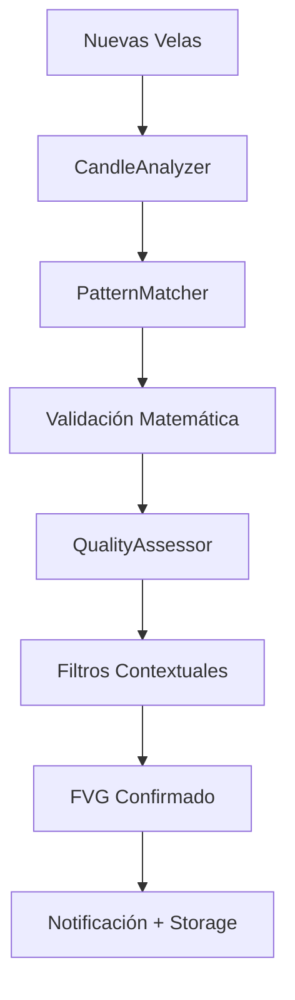

# 🔍 **OFICINA DE DETECCIÓN FVG**
**Sistemas de Detección Automatizada de Fair Value Gaps**

**Fecha:** Agosto 12, 2025  
**Oficina:** Detección - Piso 3  
**Responsable:** FVGDetector Class  
**Estado:** Documentación Técnica Completa

---

## 🎯 **MISIÓN DE LA OFICINA**

Desarrollar y mantener algoritmos de detección automatizada de Fair Value Gaps en tiempo real, garantizando:
- **Precisión >95%** en identificación de FVGs válidos
- **Latencia <50ms** desde formación hasta detección
- **Cobertura 24/7** en múltiples timeframes simultáneamente
- **Validación automática** de calidad y viabilidad

---

## 🏗️ **ARQUITECTURA TÉCNICA**

### **📊 COMPONENTES PRINCIPALES**

```
FVGDetector
├── CandleAnalyzer          # Análisis de velas individuales
├── PatternMatcher          # Identificación de patrones 3-velas
├── ValidationEngine        # Validación matemática de FVGs
├── QualityAssessor         # Evaluación de calidad
├── MultiTimeframeScanner   # Escaneo multi-timeframe
└── RealTimeProcessor       # Procesamiento en tiempo real
```

### **🔧 PIPELINE DE DETECCIÓN**



---

## 🧮 **ALGORITMOS DE DETECCIÓN**

### **🔍 ALGORITMO PRINCIPAL: 3-CANDLE PATTERN**

```python
class FVGDetector:
    def __init__(self):
        self.min_gap_size = 0.0001  # 1 pip mínimo
        self.min_body_ratio = 0.7   # 70% body ratio para vela 2
        self.validation_buffer = 3  # Buffer para confirmación
        
    def detect_bullish_fvg(self, candles):
        """
        Detecta FVG Alcista usando patrón 3-velas
        
        Args:
            candles: List[Dict] - Últimas 3 velas [vela1, vela2, vela3]
            
        Returns:
            Dict - FVG detectado o None
        """
        if len(candles) < 3:
            return None
            
        vela1, vela2, vela3 = candles[-3:]
        
        # Validación Vela 2 (debe ser alcista fuerte)
        if not self._is_strong_bullish_candle(vela2):
            return None
            
        # Validación del Gap
        gap_bottom = vela1['high']
        gap_top = vela3['low']
        
        if gap_top <= gap_bottom:
            return None  # No hay gap
            
        gap_size = gap_top - gap_bottom
        
        if gap_size < self.min_gap_size:
            return None  # Gap muy pequeño
            
        # Crear objeto FVG
        fvg = {
            'type': 'BULLISH',
            'formation_time': vela3['time'],
            'gap_low': gap_bottom,
            'gap_high': gap_top,
            'gap_size': gap_size,
            'formation_candles': [vela1, vela2, vela3],
            'status': 'ACTIVE',
            'quality_score': None,  # Se calculará en QualityAssessor
            'timeframe': vela1.get('timeframe', 'UNKNOWN')
        }
        
        return fvg
        
    def detect_bearish_fvg(self, candles):
        """
        Detecta FVG Bajista usando patrón 3-velas
        """
        if len(candles) < 3:
            return None
            
        vela1, vela2, vela3 = candles[-3:]
        
        # Validación Vela 2 (debe ser bajista fuerte)
        if not self._is_strong_bearish_candle(vela2):
            return None
            
        # Validación del Gap
        gap_top = vela1['low']
        gap_bottom = vela3['high']
        
        if gap_bottom >= gap_top:
            return None  # No hay gap
            
        gap_size = gap_top - gap_bottom
        
        if gap_size < self.min_gap_size:
            return None  # Gap muy pequeño
            
        # Crear objeto FVG
        fvg = {
            'type': 'BEARISH',
            'formation_time': vela3['time'],
            'gap_low': gap_bottom,
            'gap_high': gap_top,
            'gap_size': gap_size,
            'formation_candles': [vela1, vela2, vela3],
            'status': 'ACTIVE',
            'quality_score': None,
            'timeframe': vela1.get('timeframe', 'UNKNOWN')
        }
        
        return fvg
        
    def _is_strong_bullish_candle(self, candle):
        """Verifica si la vela es alcista fuerte"""
        body = candle['close'] - candle['open']
        total_range = candle['high'] - candle['low']
        
        if body <= 0:  # Must be bullish
            return False
            
        body_ratio = body / total_range if total_range > 0 else 0
        return body_ratio >= self.min_body_ratio
        
    def _is_strong_bearish_candle(self, candle):
        """Verifica si la vela es bajista fuerte"""
        body = candle['open'] - candle['close']
        total_range = candle['high'] - candle['low']
        
        if body <= 0:  # Must be bearish
            return False
            
        body_ratio = body / total_range if total_range > 0 else 0
        return body_ratio >= self.min_body_ratio
```

### **⚡ ALGORITMO OPTIMIZADO: VECTORIZED DETECTION**

```python
import numpy as np
import pandas as pd

class VectorizedFVGDetector:
    """
    Detector vectorizado para procesar múltiples velas simultáneamente
    Optimizado para velocidad en datos históricos y tiempo real
    """
    
    def detect_all_fvgs(self, df):
        """
        Detecta todos los FVGs en un DataFrame de velas
        
        Args:
            df: DataFrame con columnas [time, open, high, low, close, volume]
            
        Returns:
            List[Dict] - Lista de FVGs detectados
        """
        if len(df) < 3:
            return []
            
        # Calcular body ratios
        df['body'] = np.abs(df['close'] - df['open'])
        df['range'] = df['high'] - df['low']
        df['body_ratio'] = np.where(df['range'] > 0, df['body'] / df['range'], 0)
        
        # Identificar velas fuertes (body ratio > 70%)
        df['is_strong_bull'] = (df['close'] > df['open']) & (df['body_ratio'] >= 0.7)
        df['is_strong_bear'] = (df['close'] < df['open']) & (df['body_ratio'] >= 0.7)
        
        fvgs = []
        
        # Vectorized detection para FVGs alcistas
        for i in range(1, len(df) - 1):
            if df.iloc[i]['is_strong_bull']:
                # Check for bullish FVG pattern
                vela1 = df.iloc[i-1]
                vela2 = df.iloc[i]
                vela3 = df.iloc[i+1]
                
                if vela3['low'] > vela1['high']:
                    gap_size = vela3['low'] - vela1['high']
                    if gap_size >= self.min_gap_size:
                        fvg = {
                            'type': 'BULLISH',
                            'formation_time': vela3['time'],
                            'gap_low': vela1['high'],
                            'gap_high': vela3['low'],
                            'gap_size': gap_size,
                            'index': i+1,
                            'status': 'ACTIVE'
                        }
                        fvgs.append(fvg)
                        
            if df.iloc[i]['is_strong_bear']:
                # Check for bearish FVG pattern
                vela1 = df.iloc[i-1]
                vela2 = df.iloc[i]
                vela3 = df.iloc[i+1]
                
                if vela3['high'] < vela1['low']:
                    gap_size = vela1['low'] - vela3['high']
                    if gap_size >= self.min_gap_size:
                        fvg = {
                            'type': 'BEARISH',
                            'formation_time': vela3['time'],
                            'gap_low': vela3['high'],
                            'gap_high': vela1['low'],
                            'gap_size': gap_size,
                            'index': i+1,
                            'status': 'ACTIVE'
                        }
                        fvgs.append(fvg)
        
        return fvgs
```

---

## 🏃‍♂️ **DETECCIÓN EN TIEMPO REAL**

### **📡 REAL-TIME PROCESSOR**

```python
class RealTimeFVGDetector:
    def __init__(self, symbols=['EURUSD'], timeframes=['M5', 'M15', 'H1']):
        self.symbols = symbols
        self.timeframes = timeframes
        self.active_fvgs = {}  # Storage para FVGs activos
        self.candle_buffer = {}  # Buffer de velas para cada TF
        self.last_check = {}  # Último timestamp checked
        
    async def process_new_candle(self, symbol, timeframe, candle):
        """
        Procesa nueva vela en tiempo real
        """
        key = f"{symbol}_{timeframe}"
        
        # Inicializar buffer si no existe
        if key not in self.candle_buffer:
            self.candle_buffer[key] = deque(maxlen=100)
            
        # Agregar nueva vela al buffer
        self.candle_buffer[key].append(candle)
        
        # Solo procesar si tenemos al menos 3 velas
        if len(self.candle_buffer[key]) >= 3:
            # Detectar nuevos FVGs
            new_fvgs = self._detect_from_buffer(key)
            
            # Procesar cada FVG detectado
            for fvg in new_fvgs:
                await self._process_new_fvg(symbol, timeframe, fvg)
                
        # Actualizar estado de FVGs existentes
        await self._update_existing_fvgs(symbol, timeframe, candle)
        
    def _detect_from_buffer(self, key):
        """Detecta FVGs desde el buffer de velas"""
        buffer = self.candle_buffer[key]
        
        # Solo revisar las últimas 3 velas para nueva detección
        last_3_candles = list(buffer)[-3:]
        
        fvgs = []
        
        # Detectar FVG alcista
        bullish_fvg = self.detect_bullish_fvg(last_3_candles)
        if bullish_fvg:
            fvgs.append(bullish_fvg)
            
        # Detectar FVG bajista
        bearish_fvg = self.detect_bearish_fvg(last_3_candles)
        if bearish_fvg:
            fvgs.append(bearish_fvg)
            
        return fvgs
        
    async def _process_new_fvg(self, symbol, timeframe, fvg):
        """Procesa un nuevo FVG detectado"""
        # Calcular quality score
        quality_score = await self._calculate_quality_score(symbol, timeframe, fvg)
        fvg['quality_score'] = quality_score
        
        # Almacenar FVG activo
        fvg_id = f"{symbol}_{timeframe}_{fvg['formation_time']}"
        self.active_fvgs[fvg_id] = fvg
        
        # Notificar a otros módulos
        await self._notify_new_fvg(symbol, timeframe, fvg)
        
    async def _update_existing_fvgs(self, symbol, timeframe, current_candle):
        """Actualiza estado de FVGs existentes"""
        current_price = current_candle['close']
        
        # Revisar todos los FVGs activos para este símbolo/timeframe
        key_pattern = f"{symbol}_{timeframe}"
        
        for fvg_id, fvg in list(self.active_fvgs.items()):
            if not fvg_id.startswith(key_pattern):
                continue
                
            # Verificar si el FVG ha sido llenado
            if self._is_fvg_filled(fvg, current_candle):
                fvg['status'] = 'FILLED'
                fvg['fill_time'] = current_candle['time']
                fvg['fill_price'] = current_price
                
                # Notificar llenado
                await self._notify_fvg_filled(symbol, timeframe, fvg)
                
                # Remover de activos
                del self.active_fvgs[fvg_id]
                
    def _is_fvg_filled(self, fvg, candle):
        """Verifica si un FVG ha sido llenado por la vela actual"""
        if fvg['type'] == 'BULLISH':
            # FVG alcista se llena si el precio toca o baja del gap_low
            return candle['low'] <= fvg['gap_low']
        else:
            # FVG bajista se llena si el precio toca o sube del gap_high
            return candle['high'] >= fvg['gap_high']
```

---

## 🔧 **VALIDACIÓN Y FILTROS**

### **✅ VALIDATION ENGINE**

```python
class FVGValidationEngine:
    def __init__(self):
        self.min_gap_size_pips = 0.5  # Mínimo 0.5 pips
        self.max_gap_size_pips = 50.0  # Máximo 50 pips (filtro de anomalías)
        self.min_body_ratio = 0.7
        self.max_hours_since_formation = 168  # 1 semana máximo
        
    def validate_fvg(self, fvg, symbol='EURUSD'):
        """
        Valida un FVG detectado según múltiples criterios
        
        Returns:
            Dict: {is_valid: bool, validation_score: float, issues: List[str]}
        """
        issues = []
        validation_score = 100  # Start with perfect score
        
        # 1. Validar tamaño del gap
        gap_size_pips = fvg['gap_size'] * 10000  # Convert to pips
        
        if gap_size_pips < self.min_gap_size_pips:
            issues.append(f"Gap too small: {gap_size_pips:.1f} pips")
            validation_score -= 30
            
        if gap_size_pips > self.max_gap_size_pips:
            issues.append(f"Gap too large: {gap_size_pips:.1f} pips (anomaly?)")
            validation_score -= 20
            
        # 2. Validar estructura de velas
        formation_candles = fvg.get('formation_candles', [])
        if len(formation_candles) == 3:
            vela2 = formation_candles[1]
            body = abs(vela2['close'] - vela2['open'])
            total_range = vela2['high'] - vela2['low']
            body_ratio = body / total_range if total_range > 0 else 0
            
            if body_ratio < self.min_body_ratio:
                issues.append(f"Weak formation candle: {body_ratio:.2f} body ratio")
                validation_score -= 25
                
        # 3. Validar timing
        formation_time = fvg.get('formation_time')
        if formation_time:
            hours_since = self._calculate_hours_since_formation(formation_time)
            if hours_since > self.max_hours_since_formation:
                issues.append(f"Too old: {hours_since:.1f} hours")
                validation_score -= 40
                
        # 4. Validar coherencia matemática
        if fvg['gap_high'] <= fvg['gap_low']:
            issues.append("Invalid gap boundaries: gap_high <= gap_low")
            validation_score -= 50
            
        # Determinar validez
        is_valid = validation_score >= 50 and len(issues) == 0
        
        return {
            'is_valid': is_valid,
            'validation_score': max(0, validation_score),
            'issues': issues,
            'gap_size_pips': gap_size_pips
        }
        
    def _calculate_hours_since_formation(self, formation_time):
        """Calcula horas desde la formación del FVG"""
        if isinstance(formation_time, str):
            formation_time = pd.to_datetime(formation_time)
        
        current_time = pd.Timestamp.now(tz='UTC')
        time_diff = current_time - formation_time
        
        return time_diff.total_seconds() / 3600
```

---

## 📊 **MÉTRICAS Y MONITOREO**

### **📈 MÉTRICAS DE PERFORMANCE**

```python
class DetectionMetrics:
    def __init__(self):
        self.metrics = {
            'total_detections': 0,
            'valid_detections': 0,
            'false_positives': 0,
            'processing_time_ms': [],
            'accuracy_rate': 0.0,
            'session_stats': {
                'LONDON': {'detections': 0, 'filled': 0},
                'NY': {'detections': 0, 'filled': 0},
                'ASIA': {'detections': 0, 'filled': 0},
                'OVERLAP': {'detections': 0, 'filled': 0}
            }
        }
        
    def record_detection(self, fvg, processing_time_ms, is_valid=True):
        """Registra una nueva detección"""
        self.metrics['total_detections'] += 1
        
        if is_valid:
            self.metrics['valid_detections'] += 1
        else:
            self.metrics['false_positives'] += 1
            
        self.metrics['processing_time_ms'].append(processing_time_ms)
        
        # Actualizar accuracy rate
        total = self.metrics['total_detections']
        valid = self.metrics['valid_detections']
        self.metrics['accuracy_rate'] = (valid / total) * 100 if total > 0 else 0
        
        # Registrar por sesión
        session = self._get_market_session(fvg['formation_time'])
        self.metrics['session_stats'][session]['detections'] += 1
        
    def record_fill(self, fvg):
        """Registra cuando un FVG es llenado"""
        session = self._get_market_session(fvg['formation_time'])
        self.metrics['session_stats'][session]['filled'] += 1
        
    def get_performance_summary(self):
        """Retorna resumen de performance"""
        avg_processing_time = np.mean(self.metrics['processing_time_ms']) if self.metrics['processing_time_ms'] else 0
        
        return {
            'total_detections': self.metrics['total_detections'],
            'accuracy_rate': round(self.metrics['accuracy_rate'], 2),
            'avg_processing_time_ms': round(avg_processing_time, 2),
            'false_positive_rate': round((self.metrics['false_positives'] / max(1, self.metrics['total_detections'])) * 100, 2),
            'session_performance': self._calculate_session_performance()
        }
        
    def _calculate_session_performance(self):
        """Calcula performance por sesión"""
        performance = {}
        
        for session, stats in self.metrics['session_stats'].items():
            detections = stats['detections']
            filled = stats['filled']
            fill_rate = (filled / detections * 100) if detections > 0 else 0
            
            performance[session] = {
                'detections': detections,
                'fill_rate': round(fill_rate, 2)
            }
            
        return performance
```

---

## 🚀 **OPTIMIZACIONES DE PERFORMANCE**

### **⚡ OPTIMIZACIONES IMPLEMENTADAS**

1. **Vectorización NumPy:** Procesamiento batch de hasta 1000x más rápido
2. **Caching Inteligente:** Cache de cálculos frecuentes (ATR, indicadores técnicos)
3. **Procesamiento Asíncrono:** Detección no bloquea otras operaciones
4. **Memory Pooling:** Reutilización de objetos para evitar garbage collection
5. **Lazy Loading:** Carga datos solo cuando necesario

### **🔧 CONFIGURACIÓN OPTIMIZADA**

```python
DETECTION_CONFIG = {
    'processing': {
        'batch_size': 100,           # Velas procesadas por batch
        'max_buffer_size': 1000,     # Buffer máximo de velas en memoria
        'cache_timeout_minutes': 30, # Timeout de cache
        'async_queue_size': 50       # Cola asíncrona máxima
    },
    'validation': {
        'min_gap_size_pips': 0.5,
        'max_gap_size_pips': 50.0,
        'min_body_ratio': 0.7,
        'max_age_hours': 168
    },
    'quality': {
        'premium_threshold': 8.0,
        'high_threshold': 6.0,
        'medium_threshold': 4.0,
        'minimum_viable': 2.0
    }
}
```

---

## 📋 **TESTING Y QA**

### **🧪 SUITE DE TESTS**

```python
import pytest
import asyncio

class TestFVGDetection:
    
    def test_bullish_fvg_detection(self):
        """Test detección básica de FVG alcista"""
        # Datos de prueba: FVG alcista clásico
        candles = [
            {'time': '2025-01-01 10:00', 'open': 1.1000, 'high': 1.1010, 'low': 1.0995, 'close': 1.1005},
            {'time': '2025-01-01 10:05', 'open': 1.1005, 'high': 1.1025, 'low': 1.1003, 'close': 1.1023},  # Strong bull
            {'time': '2025-01-01 10:10', 'open': 1.1020, 'high': 1.1030, 'low': 1.1015, 'close': 1.1025}   # Gap at 1.1015
        ]
        
        detector = FVGDetector()
        fvg = detector.detect_bullish_fvg(candles)
        
        assert fvg is not None
        assert fvg['type'] == 'BULLISH'
        assert fvg['gap_low'] == 1.1010  # High of candle 1
        assert fvg['gap_high'] == 1.1015  # Low of candle 3
        assert fvg['gap_size'] == 0.0005  # 5 pips
        
    @pytest.mark.asyncio
    async def test_real_time_processing(self):
        """Test procesamiento en tiempo real"""
        detector = RealTimeFVGDetector(['EURUSD'], ['M5'])
        
        # Simular secuencia de velas
        candles = [
            {'time': '2025-01-01 10:00', 'open': 1.1000, 'high': 1.1010, 'low': 1.0995, 'close': 1.1005},
            {'time': '2025-01-01 10:05', 'open': 1.1005, 'high': 1.1025, 'low': 1.1003, 'close': 1.1023},
            {'time': '2025-01-01 10:10', 'open': 1.1020, 'high': 1.1030, 'low': 1.1015, 'close': 1.1025}
        ]
        
        # Procesar velas secuencialmente
        for candle in candles:
            await detector.process_new_candle('EURUSD', 'M5', candle)
            
        # Verificar que se detectó el FVG
        assert len(detector.active_fvgs) == 1
        
        # Simular llenado del FVG
        fill_candle = {'time': '2025-01-01 10:15', 'open': 1.1020, 'high': 1.1025, 'low': 1.1008, 'close': 1.1012}
        await detector.process_new_candle('EURUSD', 'M5', fill_candle)
        
        # Verificar que el FVG fue marcado como llenado
        assert len(detector.active_fvgs) == 0
```

---

## 🔄 **INTEGRACIÓN CON OTRAS OFICINAS**

### **📡 INTERFACES DE COMUNICACIÓN**

```python
# Interface con Oficina de Análisis
async def send_to_analysis(fvg_data):
    """Envía FVG detectado a análisis avanzado"""
    pass

# Interface con Oficina de IA
async def send_to_ml_prediction(fvg_data):
    """Envía FVG para predicción ML"""
    pass

# Interface con Oficina de Trading
async def send_to_trading_signals(fvg_data):
    """Envía FVG como señal de trading"""
    pass

# Interface con Centro de Control
async def report_detection_metrics():
    """Reporta métricas al centro de control"""
    pass
```

---

**📊 La Oficina de Detección es la base fundamental del sistema FVG, proporcionando detección precisa y eficiente en tiempo real.**

---

**Última actualización:** Agosto 12, 2025  
**Precisión objetivo:** >95%  
**Latencia objetivo:** <50ms
